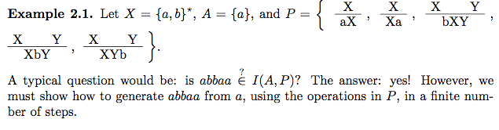

<style>
h1 a {
  display: none;
}
.container-lg {
  min-width: 200px;
  max-width: 880px;
  padding: 45px;
}
</style>

[All Notes](http://karishmadaga.com/course-notes) // [About](http://karishmadaga.com)
# CISC 223: Introduction to the Theory of Computation

## Topics

* [Alphabets, Strings, and Languages](#alph-str-lang)
  * [Halting Problem](#halting)
  * [Classification of Computing Problems](#classification)
  * [Modelling Decision Problems](#modelling)
  * [Inductive Definition of Sets and Structural Induction](#induction)
  * [Regular Expressions and their Operations](#Regular-Expressions-and-their-Operations)
* [State-Transition Diagrams](#alph-str-lang)
* [Regular Expressions vs State Diagrams](#reg-exp)
* [Minimizing State Transition Diagrams, Nonregular Languages](#min-state-trans-diagrams)
* [Context-free Languages](#context-free-lang)
* [Parsing](#parsing)
* [Specifying Algorithms](#specifying-alg)
* [Verifying Algorithms](#verifying-alg)
* [Additional Verification Techniques](#more-verification)
* [Unimplementable Specifications](#more-verification)
* [Loop Invariants and other topics](#loop-invariants)

## Extra Reading
* [Parsing and Lexical Analysis - Vaidehi Joshi](https://medium.com/basecs/reading-code-right-with-some-help-from-the-lexer-63d0be3d21d)
* [Parsing and Abstract Syntax Trees - Vaidehi Joshi](https://medium.com/basecs/leveling-up-ones-parsing-game-with-asts-d7a6fc2400ff)
* [A Deeper Inspection Into Compilation And Interpretation - Vaidehi Joshi](https://medium.com/basecs/a-deeper-inspection-into-compilation-and-interpretation-d98952ebc842)
* [Grammatically Rooting Oneself With Parse Trees - Vaidehi Joshi](https://medium.com/basecs/grammatically-rooting-oneself-with-parse-trees-ec9daeda7dad)
* [see more at basecs](https://medium.com/basecs)
<hr>
<h1 id="#alph-str-lang">Alphabets, Strings, and Languages</h1>

#### What do computers do?
They solve **decision problems**.
Decision Problems involve taking an **input** and producing a binary **output**.

An **input**, abstractly, is a finite string on a finite alphabet (set of characters).

**Algorithms**: a finite time for processing

An **output** is either true or false.

#### Other important questions:
* #### What are computers?
* #### Which tasks can a computer carry out?
* #### Which tasks are easy/hard for computers?

**Formal Methods**: the application of logic, formal languages, automata theory, and more problems in software and hardware specification and verification.

The uses of formal methods:
* lexical and parsing stages of compiler construction
* use of regular expressions in text editors
* state-charts in object oriented modelling
* circuit design
* DNA and protein sequence matching (! what)

It also acts as an 'early warning system' for what is programmatically impossible.
There exist more computing problems than the number of all possible programs, so there exist problems that are not solvable by an program or algorithm (even if it is given unbounded space and time to perform its operations).

<h2 id="halting">Famous example: The Halting Problem</h2>

[Good Reference for this topic](http://www.cgl.uwaterloo.ca/csk/halt/)

Alan Turing proved an analagous theorem in CS to Kurt Gödel's. He showed that there must exist undecidable problems (a program is decidable if it has a solution. It is undecidable if it does not in a finite time). The proof works by defining a problem (the halting problem) and proving that it can't be solved.

So, given a program *P* and an input *x* to the program, will *P* ever stop running when given *x* as an input?

Proof: Suppose (to the contrary) that *T* is a program that solves the halting problem. We'll use T as a black box (halting problem solver) to come up with a new program called *meta T*.

```
def metaT(P):
  run T on (P,P):
  if T says that P halts:
    loop infinitely
  else:
    halt and output "success"
```
MetaT accepts as input the source code of the program P and then uses T to tell if P halts (when given its own source code as input).
So, metaT behaves the opposite of P. If P halts then metaT loops infinitely and if P doesn't terminate, then metaT terminates as well.

#### What happens if we run metaT on itself?
```
metaT(metaT)
```
* Assume metaT's output is "Yes, it does halt"
* metaT then loops infinitely
* Then metaT, the program, proceeds to loop forever
* contradiction!
* metaT(metaT) doesn't halt, contradicting T's answer. So T cannot be correct, and the halting problem cannot be solved.

<h3 id="classification">Classification of Computing Problems</h3>
1. Uncomputable: even in principle cannot be solved by an algorithm
2. Solvable using unlimited resources (of time and space) but not with limited resources
3. Solvable with limited resources

Simple Problem: Test whether an arbitrary input strings (sequences of symbols/characters) can be matched given a pattern?

Efficient Techniques:
* State-transition diagrams (automata): simple simulated machines
* Regular Expressions: rules for building patterns
* Grammars: rules for generating patterns

<h2 id="modelling">Modelling Decision Problems: Alphabets, Strings, languages</h2>

We model decision problems using *formal languages*.

A decision problem has two components:
* A domain set X
* a language L that is a subset of X (L ⊆ X)

Our decision problem is then *"for some x which ∈ of X, is x an element of L"*? Example:
* x ∈ of the set of all integers Z and L = set of prime numbers
* x = set of all email messages and L = set of all spam emails
* x = set of graphs and L = set of connected graphs

#### Alphabet: denoted ∑, finite non-empty set of elements. Elements are called symbols or characters.
Example: ∑ = {a, b}, ∑ = {0, 1}, ∑ = {0, 1, 2, 3}.

#### String: denoted ∑* represents the set of all _finite_ strings over the alphabet ∑. Note: ∑* is an infinite set, but its members are finite.

**Empty String**: denoted 𝜀. 𝜀 is a string over any alphabet.
**length**: (of a string) number of occurrences of symbols in it.

#### Languages: subsets of ∑* (Language: collection of strings)
Example:
* L = empty set --> empty language (magnitude of L = 0)
* L = {𝜀} Non-empty language that contains one element.
* L = {𝜀, 0, 01, 0111}
* L = {∑* }

A compiler's task of checking their input (the code of a program) to see if the program is valid (if the code is in the language), can be seen as checking **membership** in such a language.

#### Quick Summary Example:
* ∑ = {a, b, ...}
* ∑* = {ab, abb, bab, ...}
* L = {ab, bab, baa} where L⊆∑*


### More Terminology:
* prefix: any intitial part of the string (must include the first symbols)
* suffix: any end part of the string (must include the last symbols)
* substring: any range of symbols of the string

Example: ∑ = {a, b, c} and S = abac
prefixes: 𝜀, a, ab, aba, abac
suffixes: c, ac, bac, abac
substrings: all of the prefixes, suffixes, and _ba_ and _b_


<h2 id="induction">Inductive Definition of Sets and Structural Induction</h2>

### Formal tools for Defining Sets
We want languages to be able to model every computational task. We need several different methods formally defining sets since all languages are sets.

1. List all members of a set: precise and concrete, but it makes lookups difficult (O(n)) and it fails if the set is infinitely large.
2. Set builder notation: defining sets that are infinite based on common properties that all members share
3. Inductive Definitions: Requires three components:
  * A domain set X
  * A core set A (i.e. atoms) (ex: {me})
  * a set of operations P

  Example: Set of all blood relatives. A = {me}, X = {set of all blood relatives}, and P = {"son of", "mother of", ...}. The set P is a set of functions mapping from X -> X.

  Given these components, we can define the inductive set I(A, P) as all domain elements that can be reached from the core set by applying a finite sequence of operations from P.

#### Inductive Set: defined by core set A and operations P - is the _smallest set_ satisfying:
  * contains all members of A
  * closed under operation in P

*Given a set (language) defined inductively, how can we tell if some x∈X is in the language (x∈L) or not (x∉L)?*
* Proving membership is a lot easier than proving non-membership.



*We need to generate abbaa from the core set and its operations.*


1. a belongs to the core set A
2. we get 'baa' after applying P_3(a,a)
3. 'abbaa' after applying P_4(a, baa)

*Is 𝜀 ∈ I(A, P)?*
- NO.
  - Each operation in P increases length (simple reasoning)
  - This is more difficult than proving membership

#### Closure: A set B is closed under the operations of P if for every f∈P and every x,y∈B, f(x,y)∈B.

**So the inductive set can _also_ be defined as the intersection over the _entire_ collection of sets that satisfy closure**

<h2 id="Regular-Expressions-and-their-Operations">Regular Expressions and their Operations.</h2>

Recall: Tasks will always be a decision problem. A decision problem is *"for some x ∈ X, is x an element of L"*? The set of all possible tasks is {L : L ⊆ {a,b}* }. This set is an infinite set of finite strings.

#### Regular Language: A language L is _regular_ if L can be built from the symbols of Σ and Ø using the operations union, concatenation, and kleene star (closure). A representation of L in this form is called a regular expression for L.
* Note (test trick question): {𝜀} is regular because {𝜀} = Ø*

### Operations on Languages:

* **Concatenation (•)**: Suppose there are two regular languages R and S that are the subset of Σ*, we can define the concatenation of them RS = {rs: r∈R, s∈S}.
  * Example: Let R = {0, 011} and S = {𝜀, 110}. Then RS = {0, 0110, 011, 011110}.
  * Note! Concatenation is not always **commmutative** (xy != yx), but it is **associative** ( x(yz) = z(yx) ).
* **Union (∪)**: Suppose there are two regular languages R and S that are the subset of Σ*, we can define the union of them R + S = { w∈Σ* : w∈R or w∈S}.
  * Example: Let R = {a, ab} and S = {bc, c}. R + S = {a, ab, bc, c}.
* **Kleene Star / Closure (raised * )**: Suppose there is a regular language R that is a subset of Σ*, we can define the kleene star of R as R* = {r1r2 • ... •rn : ri ∈ R where i∈N and where n >= 0}. It is essentially the concatenation of the set R with itself _i_ times. R_i is the set of all strings that can be represented as the concatenation of _i_ strings in R.
  * Example: {"ab","c"}* = {ε, "ab", "c", "abab", "abc", "cab", "cc", "ababab", "ababc", "abcab", "abcc", "cabab", "cabc", "ccab", "ccc", ...}.
  * Example: Ø* = {ε}.

#### Examples of Regular Language Operations where Σ = {a, b}:
* all strings that have suffix babbb
  * (a + b)* babbb
* all strings that have substring bbbb
  * (a + b)* bbbb (a + b)*
* all strings where the first and last symbols are different
  * a(a+b)* b + b(a + b)* a

<h1 id="#state-transition">State-Transition Diagrams</h1>

<h1 id="#reg-exp">Regular Expressions vs State Diagrams</h1>

<h1 id="#min-state-trans-diagrams">Minimizing State Transition Diagrams, Nonregular Languages</h1>

<h1 id="#context-free-lang">Context-free Languages</h1>
<h1 id="#parsing">Parsing</h1>
<h1 id="#specifying-alg">Specifying Algorithms</h1>
<h1 id="#verifying-alg">Verifying Algorithms</h1>
<h1 id="#more-verification">Additional Verification Techniques</h1>
<h1 id="#unimplementable">Unimplementable Specifications</h1>
<h1 id="#loop-invariants">Loop Invariants and other topics</h1>
